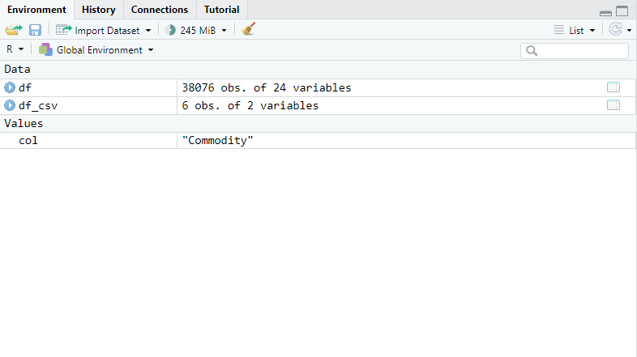

# R Bootcamp Tutorial

## Methods for cleaning data

1. Selecting/Dropping
2. Filtering
3. Variable/data types

---

## Introduction

Recall that Rmarkdown files consist of blocks or chunks of code written
in R and text written in markdown. You can run the code chunk by chunk
or by knitting the entire document at once.

In the following chunk we load packages we will need and set preferences
for knitting the document. Anything behind a "\#" symbol is "commented
code" and will be ignored by the compiler.

```{r, include = FALSE}
# Load libraries
library(cansim) # read in CODR/NDM tables
library(dplyr) # for data manipulation
library(tidyr) # for shaping the data

knitr::opts_chunk$set(warning = FALSE, message = FALSE)
```

First we need to make sure our data is loaded. It should still appear in
the upper right pane of RStudio



If it is not there, you can also run the code cell below.

```{r}
# Load our data 
df <- get_cansim("32-10-0001-01")
```

## 1. Selecting/Dropping

In short, "cleaning data" means to prepare it for analysis. Removing
empty values, converting values to the same format, dropping things you
don't need or otherwise manipulating your data to improve the quality
and uniformity are all examples of cleaning your data.

### Drop unnecessary columns

Recall from our data exploration in the previous section, some columns
did not seem to bring much value. For example:

```{r}
print(unique(df["SYMBOL"])) #prints the unique values in our SYMBOL column
```

This column is totally empty. Are there any other empty columns?

```{r}
for (col in colnames(df)){      # loop through all our columns
    if (all(is.na(df[col])))   # check if NAs appear in the respective column in ALL rows
      {print(col)}              # if so, tell us which column!
}
```

Okay, now let's drop all of these. We can write a drop statement as
follows:

```{r}
# drop uninteresting columns
df <- select(df, -( "SYMBOL" | starts_with("Classification")))
```

Or! Could we do something else?

```{r}
for (col in colnames(df)){      # loop through all our columns
    if (all(is.na(df[,col])))   # check if NAs appear in the respective column in ALL rows
      {print(col)               # if so, tell us which column
      df <- select(df, -(all_of(col)))  # drop that column from our dataframe
      }              
}
```

#### Exercise 1 {style="color:blue;"}

Can you improve on the previous code chunk to let the user know if there
are no such columns to drop?

```{r}

```

We've dealt with the empty columns, now let's deal with the *BORING*
columns. This is more or less a judgment call so let's just take a look
at our data in the explorer.

> 🚩 Best Practice: Do not hold onto data that you do not need! {style="color:red"}

We have some columns that end with ID, they're all kind of unhelpful to
me. Let's drop them.

```{r}
# drop ID columns
df <- select(df, -(ends_with("ID")))
```

#### Exercise 2 {style="color:blue;"}

What else do you want to drop?

```{r}
# your code here
df <- select(df, -("STATUS" | "DECIMALS"))
```

Even though the next topic is "dropping rows", we will be covering it in
the filtering section because it uses some different techniques than its
column-counterpart.

## 2. Filtering

So far, we have mainly been dropping items based on name. In some
situations, it would be burdensome to do so or not even possible.
Instead, we can also drop or filter based on condition.

### Ways to filter

There are many many ways to filter. We'll run through a few examples.

> 🚩 Best Practice: Do not duplicate data unless you really need to {style="color:red"}

#### Indexing

```{r}
df[df$GEO=="Canada",]
```

#### Filter function

```{r}
filter(df, GEO=="Canada")
```

```{r}
filter(df, GEO=="Canada", Commodity=="Creamery butter")
```

#### Subset function

```{r}
subset(df, GEO=="Canada")
```

#### More Filtering

You can use mathematical conditions to filter numeric data as well

```{r}
filter(df, GEO=="Canada", VALUE>4000)
```

#### Exercise 3 {style="color:blue;"}

#### Try filtering for another feature using the method of your choice. {style="color:blue;"}

```{r}
# your code
```

### Dropping rows

Note that you can use the filtering methods above to drop rows by
storing the filtered dataframe as follows.

```{r}
df <- filter(df, GEO=="Canada", Commodity=="Creamery butter")
```

## 3. Variable/datatypes

In cleaning your data, it is important to be aware of datatypes.

```{r}
typeof(df$REF_DATE)
class(df$REF_DATE)
typeof(df$Date)
class(df$Date)
```

The date type column is preferable to the character type both for performance and for analysis down the line.

### Changing variable types

Let's pretend we only had the character-type date column. Let's clean it up into the proper format

```{r}
# Let's try this again!

df$REF_DATE <- paste0(df$REF_DATE, "-01") # add a fake day to the "date" character
df$REF_DATE <- as.Date(df$REF_DATE, format="%Y-%m-%d") #change to a date object, telling as.Date what it looks like in "format="


typeof(df$REF_DATE)                          # recheck the type and class
class(df$REF_DATE)
```
